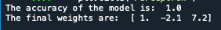

# Perceptron: Lessons Learned 

### What is a Perceptron
	From doing research and reading Learning From Data. A Short 
	Course I have learned that the Perceptron is a basic single layer
	neural network. The Perceptron is mainly used for binary classification
	problems. To mention just a few cases in which it may be used, sentimental
	analysis, positive or negative, credit loan, yes or no. 
	
	Before using the Perceptron model make sure that the data you are using
	is linearly separable. What linear separation means, is if there is a line
	that when drawn will separate your data then the Perceptron will find that 
	line. To figure out if the data is linearly separable, plot it. 
	

	
	A few points about the PLA:
		1. Its a linear classifier
		2. Binary categories
		3. Classifier seeks to divide the data by a linear separator. The 
		   separator is a (n-1) hyperplane in a n-dimensional space. 
		4. We hav N observations characterized by d features or attributes, 
		   X_n = (x1, x2, x3...xd) for n = (1,...N)
		5. As long as there are misclassified points the algorithm will update 
		   the weights in the correct direction until all of the points are 
		   correctly classified.  

	
### Iris Dataset
	
	I developed a learning model which included a hypothesis and a learning 
	algorithm. For the algorithm I had an input and output space. My output 
	space consists of two possible answers 1 or 0. I used the Iris Dataset
	which can be downloaded from various sources online like,

[Kaggle](https://www.kaggle.com "Kaggle Datasets"). 
	
	I personally used Sklearn, I imported the data set using
	
		import sklearn.datasets  # then load the iris dataset
		iris_data = sklean.dataset.load_iris()
	
	For this project I used only two of the features to implement the Perceptron,
	the Sepal width and Petal width and the first 100 data points. 
	

### The Algorithm

	1. I initialized my weights to zero.
			Remember that the w_0 needs to be 1, for the bias.
	

	
	
	2. Sum of the weights and input

		
	3. Compare results against the threshold (1 or 0)
		

	
	
	4. Update the weights
	5. 
		Why update the weights? 
		
		This was one of my first questions. I came
		to understand that weight adjustments are necessary because the single 
		layer perceptron will never be able to classify the cases or inputs 
		properly if the perceptron is unable to produce a predicted output which
		matches or is the same as the desired output.

	
	5. Repeat the process
	   I did 100 iteration, which is the size of my dataset

	

### Conclusion

	After running the program, I built from scratch, the weights were calculated 	as follow [1, -2.1. 7.2] and I got 100% prediction.
	

	
	I also compared my results with sklearn Perceptron and my results were 
	very similar, w_1 was off by a negligible amount.
	

	
	The learning curve for me was how to implement the algorithm and learning
	in depth how the weights are updated throughout the process in order for 
	the PLA model to find the correct weights that separate the data. 
	
	Implementing the model is fairly easy using sklearn, 6 lines of code is 
	all it takes to import the library implement the model, and print the 
	results. However, coding it from scratch allows for a deeper understanding 
	of the model. It is worth the effort implementing the algorithm from scratch
	because developing a strong foundation in machine learning is important in
	understanding the more difficult algorithms. 
	
	One of the things that I will look into later is adding a learning rate. By
	default my learning rate is set to 1. I would like to see how my weights
	change when I add a learning rate. 	

